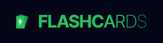

<p align="center">
  <a href="https://flash-cards-sage.vercel.app/flashcards/learn"></a>
  <p align="center"><b>An interactive and customizable flashcards application to help you study efficiently without noise.</b></p>
</p>

## Table of Contents

- [Features](#features)
- [Road Map](#road-map)
- [Tech Stack](#tech-stack)
- [Installation](#installation)
- [Usage](#usage)
- [Live Version](#live-version)
- [Contributing](#contributing)
- [License](#license)

## Features

- [x] Create, edit, and delete flashcards
- [x] User-friendly interface
- [x] Responsive design for mobile and desktop
- [x] Dark Mode
- [x] Logging in
- [x] Synchronize your flashcards across all devices
- [x] Simple repetition algorithm
- [x] Offline Mode
- [x] Intergating Local Storage and Supabase postgres Database.

## Road Map

- [ ] Review flashcards using a spaced repetition algorithm
- [ ] Organize flashcards into decks
- [ ] Community Section with shared decks
- [ ] Daily word suggestion
- [ ] Generating descriptions to words with AI
- [ ] Generating new words for deck based on words that are already in it
- [ ] Live updates (WebSockets)
- [ ] Get custom domain name
- [ ] Add Storybook

## Tech Stack

- Next.js
- Supabase
- FramerMotion
- React
- TailwindCSS
- NextPWA
- Redux
- Zod
- TypeScript
- Storybook (soon)

## Installation

```sh
   git clone https://github.com/kudziajaroslaw98/flash-cards.git

   cd flash-cards

   npm install
```

Next create `.env.local` and paste content of file `.env.template` and fill out the things required for application to work properly.

## Usage

### Running dev

```sh
   npm run dev
```

### Running production

```sh
   npm run build
   npm run start
```

## Live Version

Experience the Flashcards App in action with our live version. This is a fully functional version of the app hosted online, allowing you to explore its features and interface without needing to install anything on your local machine.

### [Live Version →](https://flash-cards-sage.vercel.app/dashboard)

### Note

The live demo is hosted on a sample database, so any changes you make will not affect your personal data. This environment is set up for you to explore and test the app's functionality freely.

### Feedback

If you encounter any issues or have suggestions for improvements, please open an issue on our GitHub repository.

## Contributing

Contributions are what make the open-source community such an amazing place to learn, inspire, and create. Any contributions you make are **greatly appreciated**.

1. Fork the Project
2. Create your Feature Branch (`git checkout -b feature/AmazingFeature`)
3. Commit your Changes (`git commit -m 'Add some AmazingFeature'`)
4. Push to the Branch (`git push origin feature/AmazingFeature`)
5. Open a Pull Request

## License

Distributed under the MIT License. See `LICENSE` for more information.
